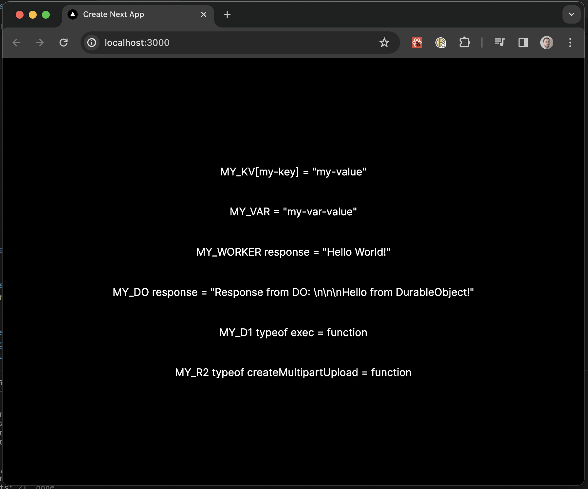

# next-on-pages stable next-dev test/demo

This repository contains a test/demo on how to access Cloudflare Bindings using the `@cloudflare/next-on-pages`'' `next-dev` sub-module (using its new stable API, introduced in https://github.com/cloudflare/next-on-pages/pull/612).

## To run it

After installing the dependencies:
```sh
npm i
```

Run the workers (that get bound to the Next.js application) and the Next.js application in parallel
with:
```sh
npm start
```

By then opening the browser at the application's root you should see the following home screen showcasing the fact that the application has access to the various type of bindings:
